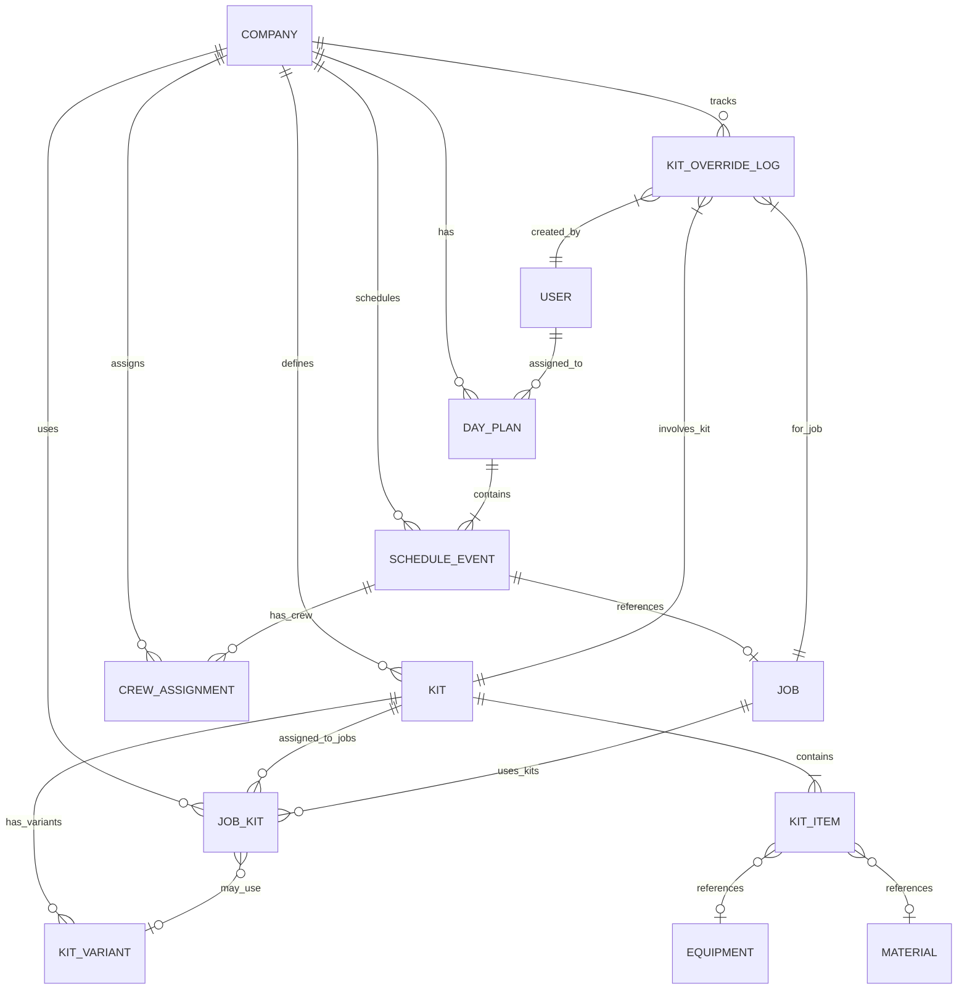

# Data Model: Scheduling, Day Plan & Kit Assignment

## Entity Relationship Diagram



## Entity Definitions

### 1. day_plans
**Purpose**: Represents a technician's daily work plan with optimized route

| Field | Type | Constraints | Description |
|-------|------|-------------|-------------|
| id | UUID | PK, NOT NULL | Unique identifier |
| company_id | UUID | FK, NOT NULL | RLS anchor to companies table |
| user_id | UUID | FK, NOT NULL | Assigned technician |
| plan_date | DATE | NOT NULL | Date of the plan |
| status | ENUM | NOT NULL | draft, published, in_progress, completed |
| route_data | JSONB | | Optimized stop sequence and route details |
| total_distance_miles | DECIMAL(10,2) | | Calculated total distance |
| estimated_duration_minutes | INTEGER | | Total estimated time |
| actual_start_time | TIMESTAMPTZ | | When technician started day |
| actual_end_time | TIMESTAMPTZ | | When technician ended day |
| voice_session_id | UUID | FK | Link to voice session if created via voice |
| metadata | JSONB | | Additional flexible data |
| created_at | TIMESTAMPTZ | NOT NULL | Record creation time |
| updated_at | TIMESTAMPTZ | NOT NULL | Last modification time |

**Indexes**:
- `idx_day_plans_company_user_date` ON (company_id, user_id, plan_date)
- `idx_day_plans_status` ON (status) WHERE status != 'completed'

### 2. schedule_events
**Purpose**: Individual events within a day plan (jobs, breaks, travel, etc.)

| Field | Type | Constraints | Description |
|-------|------|-------------|-------------|
| id | UUID | PK, NOT NULL | Unique identifier |
| company_id | UUID | FK, NOT NULL | RLS anchor |
| day_plan_id | UUID | FK, NOT NULL | Parent day plan |
| event_type | ENUM | NOT NULL | job, break, travel, maintenance, meeting |
| job_id | UUID | FK | Reference to jobs table if type=job |
| sequence_order | INTEGER | NOT NULL | Order in the day (1,2,3...) |
| scheduled_start | TIMESTAMPTZ | NOT NULL | Planned start time |
| scheduled_duration_minutes | INTEGER | NOT NULL | Expected duration |
| actual_start | TIMESTAMPTZ | | Actual start time |
| actual_end | TIMESTAMPTZ | | Actual end time |
| status | ENUM | NOT NULL | pending, in_progress, completed, cancelled, skipped |
| location_data | GEOGRAPHY(POINT) | | Geographic location |
| address | JSONB | | Structured address data |
| notes | TEXT | | General notes |
| voice_notes | TEXT | | Voice transcription notes |
| metadata | JSONB | | Additional data |
| created_at | TIMESTAMPTZ | NOT NULL | Record creation |
| updated_at | TIMESTAMPTZ | NOT NULL | Last update |

**Indexes**:
- `idx_schedule_events_plan_sequence` ON (day_plan_id, sequence_order)
- `idx_schedule_events_job` ON (job_id) WHERE job_id IS NOT NULL
- `idx_schedule_events_location` USING GIST (location_data)

### 3. crew_assignments
**Purpose**: Track which team members are assigned to schedule events

| Field | Type | Constraints | Description |
|-------|------|-------------|-------------|
| id | UUID | PK, NOT NULL | Unique identifier |
| company_id | UUID | FK, NOT NULL | RLS anchor |
| schedule_event_id | UUID | FK, NOT NULL | Parent schedule event |
| user_id | UUID | FK, NOT NULL | Assigned technician |
| role | ENUM | NOT NULL | lead, helper, trainee |
| assigned_by | UUID | FK, NOT NULL | User who made assignment |
| assigned_at | TIMESTAMPTZ | NOT NULL | When assigned |
| confirmed_at | TIMESTAMPTZ | | When technician confirmed |
| voice_confirmed | BOOLEAN | DEFAULT FALSE | Confirmed via voice |
| metadata | JSONB | | Additional data |

**Indexes**:
- `idx_crew_assignments_event_user` UNIQUE ON (schedule_event_id, user_id)
- `idx_crew_assignments_user_date` ON (user_id, assigned_at)

### 4. kits
**Purpose**: Reusable equipment/material kits for standardized job execution

| Field | Type | Constraints | Description |
|-------|------|-------------|-------------|
| id | UUID | PK, NOT NULL | Unique identifier |
| company_id | UUID | FK, NOT NULL | RLS anchor |
| kit_code | VARCHAR(50) | NOT NULL | Human-readable code |
| name | VARCHAR(255) | NOT NULL | Display name |
| description | TEXT | | Detailed description |
| category | VARCHAR(100) | | Kit category (yard, irrigation, etc) |
| is_active | BOOLEAN | DEFAULT TRUE | Available for use |
| default_container_id | UUID | FK | Default storage container |
| voice_identifier | VARCHAR(100) | | Voice command phrase |
| typical_job_types | TEXT[] | | Array of job types |
| metadata | JSONB | | Additional data |
| created_at | TIMESTAMPTZ | NOT NULL | Creation time |
| updated_at | TIMESTAMPTZ | NOT NULL | Last update |

**Indexes**:
- `idx_kits_company_code` UNIQUE ON (company_id, kit_code)
- `idx_kits_voice` ON (company_id, voice_identifier)
- `idx_kits_active` ON (company_id) WHERE is_active = true

### 5. kit_items
**Purpose**: Items that make up a kit

| Field | Type | Constraints | Description |
|-------|------|-------------|-------------|
| id | UUID | PK, NOT NULL | Unique identifier |
| kit_id | UUID | FK, NOT NULL | Parent kit |
| item_type | ENUM | NOT NULL | equipment, material, tool |
| equipment_id | UUID | FK | Reference if equipment |
| material_id | UUID | FK | Reference if material |
| quantity | DECIMAL(10,2) | NOT NULL | Required quantity |
| unit | VARCHAR(50) | | Unit of measure |
| is_required | BOOLEAN | DEFAULT TRUE | Must have to start job |
| alternate_items | UUID[] | | Alternative item IDs |
| notes | TEXT | | Special instructions |
| metadata | JSONB | | Additional data |

**Indexes**:
- `idx_kit_items_kit` ON (kit_id)
- `idx_kit_items_equipment` ON (equipment_id) WHERE equipment_id IS NOT NULL
- `idx_kit_items_material` ON (material_id) WHERE material_id IS NOT NULL

### 6. kit_variants
**Purpose**: Seasonal or conditional variations of kits

| Field | Type | Constraints | Description |
|-------|------|-------------|-------------|
| id | UUID | PK, NOT NULL | Unique identifier |
| kit_id | UUID | FK, NOT NULL | Parent kit |
| variant_code | VARCHAR(50) | NOT NULL | Variant identifier |
| variant_type | ENUM | NOT NULL | seasonal, weather, customer_type |
| conditions | JSONB | NOT NULL | When to apply variant |
| item_modifications | JSONB | NOT NULL | Add/remove/modify items |
| is_active | BOOLEAN | DEFAULT TRUE | Currently available |
| valid_from | DATE | | Start date |
| valid_until | DATE | | End date |
| metadata | JSONB | | Additional data |

**Indexes**:
- `idx_kit_variants_kit_code` UNIQUE ON (kit_id, variant_code)
- `idx_kit_variants_dates` ON (kit_id, valid_from, valid_until)

### 7. job_kits
**Purpose**: Assignment of kits to specific jobs

| Field | Type | Constraints | Description |
|-------|------|-------------|-------------|
| id | UUID | PK, NOT NULL | Unique identifier |
| company_id | UUID | FK, NOT NULL | RLS anchor |
| job_id | UUID | FK, NOT NULL | Job using the kit |
| kit_id | UUID | FK, NOT NULL | Kit assigned |
| variant_id | UUID | FK | Specific variant if applicable |
| assigned_at | TIMESTAMPTZ | NOT NULL | When assigned |
| assigned_by | UUID | FK, NOT NULL | User who assigned |
| verified_at | TIMESTAMPTZ | | When kit was verified loaded |
| verified_by | UUID | FK | User who verified |
| vision_verification_id | UUID | FK | Link to vision verification |
| modifications | JSONB | | Job-specific modifications |
| metadata | JSONB | | Additional data |

**Indexes**:
- `idx_job_kits_job` ON (job_id)
- `idx_job_kits_kit` ON (kit_id)
- `idx_job_kits_verification` ON (vision_verification_id) WHERE vision_verification_id IS NOT NULL

### 8. kit_override_log
**Purpose**: Track when required kit items are missing and overridden

| Field | Type | Constraints | Description |
|-------|------|-------------|-------------|
| id | UUID | PK, NOT NULL | Unique identifier |
| company_id | UUID | FK, NOT NULL | RLS anchor |
| job_id | UUID | FK, NOT NULL | Related job |
| kit_id | UUID | FK, NOT NULL | Kit with missing item |
| item_id | UUID | FK, NOT NULL | Missing item |
| technician_id | UUID | FK, NOT NULL | Technician who overrode |
| override_reason | TEXT | NOT NULL | Why item is missing |
| supervisor_notified_at | TIMESTAMPTZ | | When supervisor was notified |
| notification_method | ENUM | | sms, push, call |
| notification_status | VARCHAR(50) | | Delivery status |
| supervisor_response | TEXT | | Supervisor's response |
| created_at | TIMESTAMPTZ | NOT NULL | When override occurred |

**Indexes**:
- `idx_kit_override_log_job` ON (job_id)
- `idx_kit_override_log_technician_date` ON (technician_id, created_at)

## Validation Rules

### day_plans
- `plan_date` cannot be in the past when creating
- `status` transitions: draft → published → in_progress → completed
- Cannot have overlapping active plans for same user/date
- `actual_start_time` required when status = 'in_progress'

### schedule_events
- `sequence_order` must be unique within a day_plan
- `scheduled_start` + `scheduled_duration_minutes` must not exceed day boundaries
- Cannot delete if status = 'in_progress' or 'completed'
- If `event_type` = 'job', then `job_id` is required

### crew_assignments
- Cannot assign same user twice to same event
- `role` = 'lead' limited to one per event
- User must be active technician
- Cannot modify after event is completed

### kits
- `kit_code` must be unique per company
- `voice_identifier` must be unique per company if provided
- Cannot deactivate if currently assigned to active jobs

### kit_items
- Either `equipment_id` or `material_id` required, not both
- `quantity` must be positive
- `alternate_items` must reference same item_type

### job_kits
- Cannot assign inactive kits
- `variant_id` must belong to assigned `kit_id`
- Cannot modify after verification

### kit_override_log
- `override_reason` minimum 10 characters
- Automatically triggers supervisor notification
- Cannot be deleted, only viewed

## State Transitions

### Day Plan Status Flow
```
draft → published → in_progress → completed
  ↓         ↓            ↓
cancelled cancelled   cancelled
```

### Schedule Event Status Flow
```
pending → in_progress → completed
   ↓          ↓
skipped   cancelled
```

## Performance Considerations

1. **Partitioning**: Consider partitioning `schedule_events` by month for large datasets
2. **Materialized Views**: Create for common day plan summaries
3. **JSON Indexing**: Add GIN indexes on frequently queried JSONB fields
4. **Archival**: Move completed day plans older than 1 year to archive tables

## Security Notes

1. All tables require company-scoped RLS policies
2. Technicians can only view/modify their assigned items
3. Supervisors can view all team data
4. Dispatchers have full scheduling access
5. Audit all modifications through triggers