# MVP Architecture Guide

> **Feature 007**: Intent-Driven Mobile App Architecture Documentation

## System Overview

The MVP Intent-Driven Mobile App follows a modern full-stack architecture optimized for mobile-first, voice-driven workflows with offline capabilities.

## Architecture Principles

### 1. Voice-First Design
- Every user-facing feature considers voice interaction
- Speech-to-Text (STT) and Text-to-Speech (TTS) integration
- Voice command routing and intent recognition
- Audio feedback for accessibility

### 2. Offline-First Architecture
- Local data persistence with IndexedDB
- Background synchronization with conflict resolution
- Progressive Web App (PWA) capabilities
- Graceful degradation when offline

### 3. Role-Based Access Control
- Middleware-enforced authentication
- Granular permission system
- Context-aware UI rendering
- Secure API endpoints

### 4. Cost-Optimized AI Pipeline
- Hybrid local/cloud processing
- Budget constraints ($10/day VLM limit)
- Intelligent fallback strategies
- Real-time cost monitoring

## Technology Stack

### Frontend
```
Next.js 14 (App Router)
├── TypeScript (Strict mode)
├── Tailwind CSS (Utility-first styling)
├── React 18 (Concurrent features)
├── PWA (Service Worker + Manifest)
└── Web APIs (Speech, Camera, Geolocation)
```

### Backend
```
Supabase
├── PostgreSQL (Row Level Security)
├── Authentication (JWT tokens)
├── Storage (File uploads)
├── Edge Functions (Serverless)
└── Real-time (WebSocket subscriptions)
```

### AI/ML Stack
```
Computer Vision
├── YOLO v11n (Local ONNX inference)
├── OpenAI GPT-4 Vision (Cloud VLM)
├── Web Speech API (STT/TTS)
└── Intent Classification Pipeline
```

### Infrastructure
```
Railway.app
├── Automatic deployments
├── Environment management
├── Scaling & monitoring
└── PostgreSQL hosting
```

## Core System Architecture

```mermaid
graph TB
    User[👤 User] --> PWA[📱 PWA App]
    PWA --> SW[🔄 Service Worker]
    PWA --> UI[🖥️ UI Components]
    
    UI --> VN[🎤 Voice Navigator]
    UI --> Camera[📷 Camera Capture]
    UI --> Forms[📝 Forms]
    
    VN --> STT[🗣️ Speech-to-Text]
    VN --> TTS[🔊 Text-to-Speech]
    
    Camera --> Intent[🧠 Intent Recognition]
    Intent --> YOLO[🤖 Local YOLO]
    Intent --> VLM[☁️ Cloud VLM]
    
    UI --> API[🔌 API Layer]
    API --> Auth[🔐 Auth Middleware]
    Auth --> RLS[🛡️ Row Level Security]
    
    API --> DB[(📊 PostgreSQL)]
    API --> Storage[💾 Supabase Storage]
    
    SW --> IDB[(📱 IndexedDB)]
    SW --> Sync[🔄 Background Sync]
    Sync --> Queue[📤 Sync Queue]
```



## Data Flow Architecture

### 1. Intent Recognition Pipeline


### 2. Offline Data Synchronization


### 3. Voice Command Processing


## Directory Structure

```
src/
├── app/                    # Next.js App Router
│   ├── api/               # API endpoints
│   │   ├── intent/        # Intent recognition
│   │   ├── supervisor/    # Supervisor operations
│   │   ├── crew/          # Crew operations
│   │   └── vision/        # Computer vision
│   ├── admin/             # Admin dashboard
│   ├── supervisor/        # Supervisor interface
│   └── crew/              # Crew interface
│
├── components/            # React components
│   ├── ui/               # Base UI components
│   ├── forms/            # Form components
│   ├── camera/           # Camera functionality
│   ├── voice/            # Voice components
│   └── accessibility/    # A11y components
│
├── domains/              # Business logic domains
│   ├── intent/           # Intent recognition
│   ├── supervisor/       # Supervisor domain
│   ├── crew/             # Crew domain
│   └── vision/           # Computer vision
│
├── lib/                  # Shared libraries
│   ├── auth/             # Authentication
│   ├── voice/            # Voice processing
│   ├── offline/          # Offline functionality
│   ├── performance/      # Performance optimization
│   ├── accessibility/    # Accessibility features
│   └── error/            # Error handling
│
├── hooks/                # React hooks
├── types/                # TypeScript definitions
└── core/                 # Core utilities
    ├── config/           # Configuration
    ├── logger/           # Logging system
    └── errors/           # Error definitions
```

## Component Architecture

### 1. Agent Directive Blocks
Every file follows the Architecture-as-Code pattern with directive blocks:

```typescript
/**
 * AGENT DIRECTIVE BLOCK
 * 
 * file: /src/components/example/component.tsx
 * phase: 3
 * domain: example
 * purpose: Brief description of component purpose
 * spec_ref: 007-mvp-intent-driven/contracts/component.md
 * complexity_budget: 300
 * migrations_touched: []
 * state_machine: {
 *   states: ['idle', 'loading', 'success', 'error'],
 *   transitions: [
 *     'idle->loading: startAction()',
 *     'loading->success: actionComplete()',
 *     'loading->error: actionFailed()'
 *   ]
 * }
 * offline_capability: REQUIRED | OPTIONAL | NONE
 * dependencies: { internal: [], external: [], supabase: [] }
 * exports: ['ComponentName', 'ComponentProps']
 * voice_considerations: Voice interaction requirements
 * test_requirements: { coverage: 90, unit_tests: 'path/to/tests' }
 */
```

### 2. State Management Pattern
Uses React's built-in state management with custom hooks:

```typescript
// Domain-specific state hook
export function useJobManagement() {
  const [jobs, setJobs] = useState<Job[]>([]);
  const [loading, setLoading] = useState(false);
  const [error, setError] = useState<Error | null>(null);

  const loadJobs = useCallback(async () => {
    setLoading(true);
    try {
      const response = await api.getJobs();
      setJobs(response.jobs);
    } catch (err) {
      setError(err as Error);
    } finally {
      setLoading(false);
    }
  }, []);

  return { jobs, loading, error, loadJobs };
}
```

### 3. Repository Pattern
Data access abstracted through repositories:

```typescript
export class JobRepository {
  constructor(private supabase: SupabaseClient) {}

  async findByCrewId(crewId: string): Promise<Job[]> {
    const { data, error } = await this.supabase
      .from('jobs')
      .select('*')
      .eq('assigned_crew_id', crewId)
      .eq('company_id', getCurrentCompanyId());

    if (error) throw new DatabaseError(error.message);
    return data.map(row => this.mapToJob(row));
  }

  private mapToJob(row: any): Job {
    return {
      id: row.id,
      title: row.title,
      status: row.status,
      // ... mapping logic
    };
  }
}
```

## Security Architecture

### 1. Authentication Flow

```mermaid
graph LR
    Login[🔑 Login] --> Supabase[🔐 Supabase Auth]
    Supabase --> JWT[📜 JWT Token]
    JWT --> Middleware[🛡️ Auth Middleware]
    Middleware --> RLS[🔒 Row Level Security]
    RLS --> Data[📊 User Data]
```


### 2. Row Level Security (RLS)
PostgreSQL policies enforce data isolation:

```sql
-- Jobs policy: Users can only see jobs for their company
CREATE POLICY jobs_company_isolation ON jobs
  FOR ALL
  USING (company_id = auth.jwt() ->> 'company_id');

-- Crew can only see assigned jobs
CREATE POLICY jobs_crew_access ON jobs
  FOR SELECT
  USING (
    assigned_crew_id = auth.uid() OR
    supervisor_id = auth.uid()
  );
```

### 3. API Security
Middleware enforces role-based access:

```typescript
export function withAuth(handler: AuthenticatedHandler) {
  return async (req: NextRequest) => {
    const token = req.headers.get('authorization')?.replace('Bearer ', '');
    if (!token) return unauthorized();

    const user = await verifyToken(token);
    if (!user) return unauthorized();

    const tenantId = user.app_metadata?.company_id;
    return handler(user, tenantId);
  };
}
```

## Performance Architecture

### 1. Caching Strategy
Multi-layer caching for optimal performance:

```
Request → Memory Cache → Persistent Cache → IndexedDB → API
```

### 2. Image Optimization Pipeline

```mermaid
graph LR
    Upload[📷 Image Upload] --> Compress[🗜️ Client Compression]
    Compress --> Thumbnail[🖼️ Thumbnail Generation]
    Thumbnail --> Cache[💾 Cache Storage]
    Cache --> CDN[☁️ Supabase Storage]
```


### 3. Bundle Optimization
- **Code Splitting**: Route-based chunks
- **Tree Shaking**: Remove unused code
- **Dynamic Imports**: Lazy load components
- **Image Optimization**: Next.js image optimization

## Offline Architecture

### 1. Data Persistence
```typescript
interface OfflineOperation {
  id: string;
  type: 'create' | 'update' | 'delete';
  table: string;
  data: any;
  timestamp: number;
  priority: 'high' | 'medium' | 'low';
  retries: number;
  maxRetries: number;
}
```

### 2. Conflict Resolution
```typescript
enum ConflictResolution {
  ClientWins = 'client_wins',
  ServerWins = 'server_wins',
  MergeFields = 'merge_fields',
  CreateDuplicate = 'create_duplicate'
}
```

### 3. Service Worker Strategy
```typescript
// Network first with offline fallback
self.addEventListener('fetch', (event) => {
  if (event.request.url.includes('/api/')) {
    event.respondWith(
      fetch(event.request)
        .catch(() => handleOfflineRequest(event.request))
    );
  }
});
```

## Monitoring & Observability

### 1. Performance Monitoring
```typescript
interface PerformanceMetrics {
  fcp: number;           // First Contentful Paint
  lcp: number;           // Largest Contentful Paint
  fid: number;           // First Input Delay
  cls: number;           // Cumulative Layout Shift
  voiceLatency: number;  // Voice processing time
  cacheHitRate: number;  // Cache efficiency
}
```

### 2. Error Tracking
```typescript
interface ErrorEvent {
  type: 'javascript' | 'network' | 'voice' | 'indexeddb';
  message: string;
  stack?: string;
  context: {
    userId: string;
    userRole: string;
    route: string;
    timestamp: number;
  };
}
```

### 3. Cost Monitoring
```typescript
interface CostMetrics {
  dailyVLMCost: number;
  requestCount: number;
  averageCostPerRequest: number;
  budgetUtilization: number; // 0-1
  warnings: string[];
}
```

## Deployment Architecture

### 1. Build Pipeline
```yaml
# Railway deployment
build:
  commands:
    - npm ci
    - npm run build
    - npm run generate:types
  
deploy:
    start: npm start
    healthcheck: /api/health
```

### 2. Environment Configuration
```typescript
interface EnvironmentConfig {
  NEXT_PUBLIC_SUPABASE_URL: string;
  NEXT_PUBLIC_SUPABASE_ANON_KEY: string;
  SUPABASE_SERVICE_ROLE_KEY: string;
  OPENAI_API_KEY?: string;
  NODE_ENV: 'development' | 'production';
}
```

### 3. Database Migrations
```typescript
// Migration strategy
interface Migration {
  version: string;
  description: string;
  up: () => Promise<void>;
  down: () => Promise<void>;
  checkpoints: string[];
}
```

## Testing Architecture

### 1. Test Pyramid
```
     /\
    /E2E\     <- Playwright (Critical workflows)
   /____\
  /      \
 /Integration\ <- API + Database tests
/__________\
/          \
/   Unit     \ <- Jest (Component + Logic)
/____________\
```

### 2. Test Organization
```
tests/
├── unit/              # Jest unit tests
│   ├── components/    # Component tests
│   ├── hooks/         # Hook tests
│   ├── utils/         # Utility tests
│   └── services/      # Service tests
├── integration/       # API + Database tests
│   ├── api/           # API endpoint tests
│   ├── auth/          # Authentication tests
│   └── database/      # Database operation tests
└── e2e/               # Playwright E2E tests
    ├── auth.spec.ts   # Authentication flows
    ├── jobs.spec.ts   # Job management
    └── voice.spec.ts  # Voice interactions
```

### 3. Test Patterns
```typescript
// Component testing with voice navigation
describe('JobDashboard', () => {
  it('should handle voice commands', async () => {
    const mockVoiceNav = {
      isActive: true,
      availableCommands: ['start job', 'take photo'],
      handleCustomCommand: jest.fn()
    };

    render(<JobDashboard />, {
      wrapper: ({ children }) => (
        <VoiceNavigationProvider mock={mockVoiceNav}>
          {children}
        </VoiceNavigationProvider>
      )
    });

    // Test voice command handling
    fireEvent.voice('start job');
    expect(mockVoiceNav.handleCustomCommand).toHaveBeenCalledWith('start job');
  });
});
```

## Scaling Considerations

### 1. Performance Bottlenecks
- **VLM API Costs**: Budget constraints limit concurrent requests
- **IndexedDB Storage**: Browser storage quotas
- **Voice Processing**: Real-time STT/TTS latency
- **Image Processing**: Client-side compression performance

### 2. Horizontal Scaling
- **API Routes**: Stateless design enables scaling
- **Database**: Supabase handles connection pooling
- **Storage**: CDN distribution for static assets
- **Edge Functions**: Serverless auto-scaling

### 3. Future Architecture Evolution


## Troubleshooting Architecture

### 1. Common Issues
- **Voice Recognition**: Browser compatibility variations
- **Camera Access**: Permission and HTTPS requirements
- **Offline Sync**: Network timing and conflict resolution
- **Performance**: Memory leaks and cache management

### 2. Debugging Tools
- **Performance Monitor**: Real-time metrics dashboard
- **Error Recovery**: Automatic retry mechanisms
- **Cache Inspector**: Cache state visualization
- **Voice Debugger**: STT/TTS quality monitoring

### 3. Health Checks
```typescript
interface SystemHealth {
  database: 'healthy' | 'degraded' | 'down';
  storage: 'healthy' | 'degraded' | 'down';
  voice: 'healthy' | 'degraded' | 'down';
  vision: 'healthy' | 'degraded' | 'down';
  overall: 'healthy' | 'degraded' | 'critical';
}
```

---

This architecture supports the MVP requirements while maintaining scalability and maintainability for future enhancements.