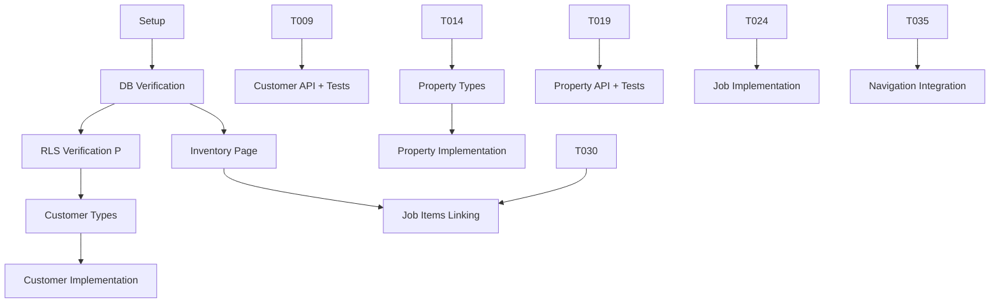

# Tasks: Integrate Job Creation Workflow for Authenticated Supervisors

**Feature**: 007-integrate-job-creation-workflow
**Branch**: `007-integrate-job-creation-workflow`
**Generated**: 2025-10-14
**Input**: [plan.md](./plan.md), [data-model.md](./data-model.md), [contracts/](./contracts/), [quickstart.md](./quickstart.md)

## Overview

This task list implements the authenticated job creation workflow: Customer → Property → Inventory Items → Job → Assign Items to Job. Tasks follow TDD principles where applicable and respect Constitution §8 requirements.

**Critical Constraints**:
- ❌ DO NOT create job_items table (job_checklist_items already exists)
- ✅ Use existing demo-properties/utils.ts adapter for properties
- ✅ Ignore items.assigned_to_job_id field (UNUSED)
- ✅ All database operations through repository pattern
- ✅ All pages require authentication (withAuth wrapper)
- ✅ All API routes use getRequestContext() for tenant filtering

## Task Statistics

- **Total Tasks**: 36
- **Parallel Tasks**: 9 (marked with [P])
- **Estimated Time**: 18-22 hours
- **Dependencies**: Sequential within domains, parallel across domains

## Execution Guide

### Running Parallel Tasks

Tasks marked `[P]` can be executed simultaneously as they operate on different files:

```bash
# Example: Run multiple parallel tasks
# In separate terminals or agents:
Task 1: "Execute T003 - verify customers table RLS"
Task 2: "Execute T004 - verify properties table RLS"
Task 3: "Execute T005 - verify items table RLS"
```

### Task Dependencies



---

## Phase 0: Setup & Verification

### T001: Initialize Feature Branch [P]
**Type**: Setup
**Estimated Time**: 5 minutes
**Dependencies**: None
**Files**: None (git operation)

**Task**:
1. Ensure you're on branch `007-integrate-job-creation-workflow`
2. Pull latest changes from main
3. Verify no uncommitted changes

**Commands**:
```bash
git checkout 007-integrate-job-creation-workflow
git pull origin main
git status
```

**Acceptance Criteria**:
- [x] Branch `007-integrate-job-creation-workflow` exists
- [x] No merge conflicts
- [x] Working directory clean

---

### T002: Verify Database Schema via MCP
**Type**: Database Verification (Constitution §8.1)
**Estimated Time**: 15 minutes
**Dependencies**: T001
**Files**: None (query operation, document findings)

**Task**:
1. Use Supabase MCP or create script to query live database
2. Verify tables exist: customers, properties, items, jobs, job_checklist_items
3. Confirm column counts match data-model.md:
   - customers: 18 columns
   - properties: 22 columns
   - items: 42 columns
   - jobs: 54 columns
4. Verify job_checklist_items has: id, job_id, item_id, item_name, quantity, notes
5. Document any schema mismatches

**Query Example**:
```python
import requests
response = requests.get(
    f"{SUPABASE_URL}/rest/v1/customers",
    headers={"apikey": SUPABASE_SERVICE_KEY, "Authorization": f"Bearer {SUPABASE_SERVICE_KEY}"},
    params={"limit": 1}
)
print(f"Customers columns: {len(response.json()[0].keys())}")
```

**Acceptance Criteria**:
- [x] All 5 tables exist
- [x] Column counts match specifications
- [x] job_checklist_items confirmed (NOT job_items)
- [x] Findings documented (comment or in plan.md)

---

### T003: Verify RLS Policy on customers Table [P]
**Type**: Security Verification (Constitution §1)
**Estimated Time**: 10 minutes
**Dependencies**: T002
**Files**: None (query operation)

**Task**:
1. Query pg_policies view for customers table RLS policies
2. Verify tenant_isolation policy exists
3. Confirm policy uses `app_metadata` path (NOT auth.jwt())
4. Test policy: Query as authenticated user, verify tenant filtering

**Expected RLS Pattern**:
```sql
CREATE POLICY "tenant_isolation" ON customers
  FOR ALL USING (
    tenant_id::text = (current_setting('request.jwt.claims', true)::json -> 'app_metadata' ->> 'tenant_id')
  );
```

**Acceptance Criteria**:
- [x] RLS enabled on customers table
- [x] tenant_isolation policy exists
- [x] Policy uses correct app_metadata path
- [x] Manual test confirms tenant filtering works

---

### T004: Verify RLS Policy on properties Table [P]
**Type**: Security Verification (Constitution §1)
**Estimated Time**: 10 minutes
**Dependencies**: T002
**Files**: None (query operation)

**Task**: Same as T003 but for properties table

**Acceptance Criteria**:
- [x] RLS enabled on properties table
- [x] tenant_isolation policy exists
- [x] Policy uses correct app_metadata path

---

### T005: Verify RLS Policy on items Table [P]
**Type**: Security Verification (Constitution §1)
**Estimated Time**: 10 minutes
**Dependencies**: T002
**Files**: None (query operation)

**Task**: Same as T003 but for items table

**Acceptance Criteria**:
- [x] RLS enabled on items table
- [x] tenant_isolation policy exists
- [x] Policy uses correct app_metadata path

---

### T006: Verify RLS Policy on jobs and job_checklist_items Tables [P]
**Type**: Security Verification (Constitution §1)
**Estimated Time**: 15 minutes
**Dependencies**: T002
**Files**: None (query operation)

**Task**:
1. Verify RLS on jobs table (same as T003)
2. Verify RLS on job_checklist_items table
3. Confirm job_checklist_items policy allows supervisors to manage items

**Acceptance Criteria**:
- [x] RLS enabled on both tables
- [x] tenant_isolation policies exist
- [x] Policies use correct app_metadata path

---

## Phase 1: Customer Management Domain

### T007: Create Customer Types [P]
**Type**: Domain Model
**Estimated Time**: 20 minutes
**Dependencies**: T002
**Files**:
- `/src/domains/customer/types/customer.ts` (CREATE)

**Task**:
1. Create `/src/domains/customer/types/` directory
2. Define Customer interface matching data-model.md Section 2.1:
   ```typescript
   export interface Customer {
     id: string;
     tenant_id: string;
     customer_number: string;
     name: string;
     email: string;
     phone: string | null;
     mobile_phone: string | null;
     billing_address: Address;
     service_address: Address | null;
     created_at: string;
     updated_at: string;
   }

   export interface Address {
     street: string;
     city: string;
     state: string;
     zip: string;
   }

   export interface CreateCustomerInput {
     name: string;
     email: string;
     phone?: string;
     mobile_phone?: string;
     billing_address: Address;
     service_address?: Address;
   }

   export interface UpdateCustomerInput extends Partial<CreateCustomerInput> {}
   ```

**Acceptance Criteria**:
- [x] Customer interface matches database schema
- [x] Address type defined for JSONB fields
- [x] Create/Update input types defined
- [x] File follows TypeScript best practices

---

### T008: Create Customer Repository
**Type**: Repository (Constitution §5)
**Estimated Time**: 45 minutes
**Dependencies**: T007
**Files**:
- `/src/domains/customer/repositories/customer-repository.ts` (CREATE)

**Task**:
1. Create `/src/domains/customer/repositories/` directory
2. Follow PropertyRepository pattern from existing code
3. Implement methods:
   - `findAll(tenantId: string, options?: QueryOptions): Promise<Customer[]>`
   - `findById(id: string, tenantId: string): Promise<Customer | null>`
   - `create(input: CreateCustomerInput, tenantId: string): Promise<Customer>`
   - `update(id: string, input: UpdateCustomerInput, tenantId: string): Promise<Customer>`
   - `delete(id: string, tenantId: string): Promise<void>`
4. Use Supabase client from `/src/lib/supabase/server.ts`
5. Add `.eq('tenant_id', tenantId)` to all queries
6. Auto-generate customer_number: `CUST-${Date.now()}`

**Reference**: `/src/domains/property/repositories/property-repository.ts`

**Acceptance Criteria**:
- [x] All CRUD methods implemented
- [x] Tenant filtering on every query
- [x] Customer number auto-generation
- [x] Error handling for foreign key violations
- [x] Returns typed Customer objects

---

### T009: Implement Customer Address Adapter
**Type**: Utility
**Estimated Time**: 30 minutes
**Dependencies**: T007
**Files**:
- `/src/app/supervisor/customers/_utils/customer-adapter.ts` (CREATE)

**Task**:
1. Create utility file in `/src/app/supervisor/customers/_utils/`
2. Implement functions similar to demo-properties/utils.ts:
   ```typescript
   export function buildCustomerPayload(form: CustomerFormState) {
     return {
       name: form.name,
       email: form.email,
       phone: form.phone || null,
       mobile_phone: form.mobilePhone || null,
       billing_address: {
         street: form.billingStreet,
         city: form.billingCity || 'N/A',
         state: form.billingState?.toUpperCase() || 'N/A',
         zip: form.billingZip || '00000'
       },
       service_address: form.useServiceAddress ? {
         street: form.serviceStreet,
         city: form.serviceCity || 'N/A',
         state: form.serviceState?.toUpperCase() || 'N/A',
         zip: form.serviceZip || '00000'
       } : null
     };
   }

   export function parseCustomerForForm(customer: Customer): CustomerFormState {
     // Reverse transformation: JSONB → form fields
   }
   ```

**Reference**: `/src/app/demo-properties/utils.ts` buildPropertyPayload()

**Acceptance Criteria**:
- [x] buildCustomerPayload transforms form → JSONB
- [x] parseCustomerForForm transforms JSONB → form
- [x] Handles optional service_address
- [x] Validates required fields

---

### T010: Create Customer API Route - GET /api/supervisor/customers
**Type**: API Implementation
**Estimated Time**: 30 minutes
**Dependencies**: T008
**Files**:
- `/src/app/api/supervisor/customers/route.ts` (CREATE)

**Task**:
1. Create `/src/app/api/supervisor/customers/` directory
2. Implement GET and POST handlers in route.ts
3. GET handler:
   - Use `getRequestContext()` to get tenantId
   - Call `customerRepository.findAll(tenantId)`
   - Return JSON array
   - Handle pagination (limit, offset query params)
4. Reference existing `/src/app/api/supervisor/items/route.ts`

**Contract**: `contracts/customers-api.json` → GET /api/supervisor/customers

**Acceptance Criteria**:
- [x] GET returns array of customers for authenticated tenant
- [x] Returns 401 if no tenant context
- [x] Supports pagination query params
- [x] Returns 200 with JSON array

---

### T011: Create Customer API Route - POST /api/supervisor/customers
**Type**: API Implementation
**Estimated Time**: 30 minutes
**Dependencies**: T008, T009
**Files**:
- `/src/app/api/supervisor/customers/route.ts` (EDIT - add POST handler)

**Task**:
1. Add POST handler to existing route.ts
2. Parse request body (CreateCustomerInput)
3. Validate required fields (name, email, billing_address)
4. Use `getRequestContext()` to get tenantId
5. Call `customerRepository.create(input, tenantId)`
6. Return 201 with { id, customer_number, message }

**Contract**: `contracts/customers-api.json` → POST /api/supervisor/customers

**Acceptance Criteria**:
- [x] POST creates customer with auto-generated customer_number
- [x] Returns 201 with success message
- [x] Returns 400 for validation errors
- [x] Returns 401 if no tenant context
- [x] Tenant ID auto-set from auth context

---

### T012: Create Customer API Route - GET/PUT/DELETE [id]
**Type**: API Implementation
**Estimated Time**: 45 minutes
**Dependencies**: T008
**Files**:
- `/src/app/api/supervisor/customers/[id]/route.ts` (CREATE)

**Task**:
1. Create `/src/app/api/supervisor/customers/[id]/` directory
2. Implement GET, PUT, DELETE handlers
3. GET: `customerRepository.findById(id, tenantId)`
4. PUT: `customerRepository.update(id, input, tenantId)`
5. DELETE: `customerRepository.delete(id, tenantId)` (handle FK violations)

**Contract**: `contracts/customers-api.json` → GET/PUT/DELETE /api/supervisor/customers/[id]

**Acceptance Criteria**:
- [x] GET returns single customer or 404
- [x] PUT updates customer, returns 200
- [x] DELETE returns 409 if customer has properties
- [x] All methods enforce tenant isolation (404 for other tenant's data)

---

### T013: Create CustomerForm Component
**Type**: UI Component
**Estimated Time**: 1 hour
**Dependencies**: T009
**Files**:
- `/src/app/supervisor/customers/_components/CustomerForm.tsx` (CREATE)

**Task**:
1. Copy form structure from `/src/app/demo-crud/CustomerForm.tsx` (if exists)
2. Use controlled form pattern with parent state management
3. Form fields:
   - Name, Email, Phone, Mobile Phone
   - Billing Address (street, city, state, zip)
   - Service Address (optional, checkbox to enable)
4. Call `buildCustomerPayload()` before submission
5. Submit to POST /api/supervisor/customers or PUT /api/supervisor/customers/[id]
6. Show success/error notifications

**Acceptance Criteria**:
- [x] Form validates required fields
- [x] Service address section toggleable
- [x] Transforms form data via adapter before submission
- [x] Handles loading and error states
- [x] Shows success notification on save

---

### T014: Create Customer List Page
**Type**: Page Component
**Estimated Time**: 1 hour
**Dependencies**: T010, T011, T012, T013
**Files**:
- `/src/app/supervisor/customers/page.tsx` (CREATE)
- `/src/app/supervisor/customers/_components/CustomerList.tsx` (CREATE)

**Task**:
1. Create page.tsx with withAuth wrapper
2. Fetch customers from GET /api/supervisor/customers
3. Display table with: customer_number, name, email, phone, city
4. Add "Create Customer" button → opens CustomerForm modal
5. Add "Edit" and "Delete" actions per row
6. Handle delete with confirmation (warn if properties exist)

**Reference**: `/src/app/demo-crud/` pages

**Acceptance Criteria**:
- [x] Page requires authentication (redirects to /sign-in if not logged in)
- [x] Lists all customers for authenticated tenant
- [x] Create/Edit/Delete operations work
- [x] Shows loading state during fetch
- [x] Handles empty state (no customers)

---

## Phase 2: Property Management Domain

### T015: Create Property Types [P]
**Type**: Domain Model
**Estimated Time**: 15 minutes
**Dependencies**: T002
**Files**:
- `/src/domains/property/types/property.ts` (CREATE or EDIT if exists)

**Task**:
1. Check if `/src/domains/property/types/property.ts` exists
2. If not, create it with Property interface matching data-model.md Section 2.2
3. Include PropertyAddress type for JSONB field:
   ```typescript
   export interface PropertyAddress {
     line1: string;
     line2?: string;
     city: string;
     state: string;
     postal_code: string;
     country?: string;
     lat?: number;
     lon?: number;
   }

   export interface Property {
     id: string;
     tenant_id: string;
     customer_id: string;
     property_number: string;
     address: PropertyAddress;
     notes: string | null;
     lot_size: string | null;
     gate_code: string | null;
     created_at: string;
     updated_at: string;
   }
   ```

**Acceptance Criteria**:
- [x] Property interface matches database schema (22 columns)
- [x] PropertyAddress type defined for JSONB field
- [x] Create/Update input types defined

---

### T016: Verify PropertyRepository Exists
**Type**: Repository Verification
**Estimated Time**: 10 minutes
**Dependencies**: T015
**Files**:
- `/src/domains/property/repositories/property-repository.ts` (READ)

**Task**:
1. Read existing PropertyRepository
2. Verify it has methods: findAll, findById, create, update, delete
3. Check if it includes customer join in findAll
4. If missing customer join, note for T017

**Acceptance Criteria**:
- [x] PropertyRepository exists and is functional
- [x] Has all CRUD methods with tenant filtering
- [x] Document if customer join needs to be added

---

### T017: Update PropertyRepository for Customer Join
**Type**: Repository Enhancement
**Estimated Time**: 20 minutes
**Dependencies**: T016
**Files**:
- `/src/domains/property/repositories/property-repository.ts` (EDIT)

**Task**:
1. Update findAll() to join with customers table:
   ```typescript
   const { data, error } = await this.supabase
     .from('properties')
     .select(`
       *,
       customer:customers!customer_id (
         id,
         name,
         email
       )
     `)
     .eq('tenant_id', tenantId);
   ```
2. Update Property type to include optional customer field

**Acceptance Criteria**:
- [x] findAll returns properties with nested customer object
- [x] Customer includes id, name, email
- [x] Existing functionality not broken

---

### T018: Create Property API Routes
**Type**: API Implementation
**Estimated Time**: 1 hour
**Dependencies**: T017
**Files**:
- `/src/app/api/supervisor/properties/route.ts` (CREATE)
- `/src/app/api/supervisor/properties/[id]/route.ts` (CREATE)

**Task**:
1. Implement GET /api/supervisor/properties (list with customer join)
2. Implement POST /api/supervisor/properties
3. Implement GET/PUT/DELETE /api/supervisor/properties/[id]
4. ✅ REUSE existing demo-properties/utils.ts adapter (no new adapter needed)
5. Validate customer_id belongs to same tenant before creating property
6. Handle FK violations on delete (properties with jobs)

**Contract**: `contracts/properties-api.json`

**Acceptance Criteria**:
- [x] All CRUD operations work
- [x] Property list includes customer info
- [x] Validates customer_id exists for tenant
- [x] Returns 409 if property has jobs (delete)
- [x] Tenant isolation enforced

---

### T019: Create PropertyForm Component
**Type**: UI Component
**Estimated Time**: 1 hour
**Dependencies**: T018
**Files**:
- `/src/app/supervisor/properties/_components/PropertyForm.tsx` (CREATE)

**Task**:
1. Copy structure from `/src/app/demo-properties/PropertyForm.tsx`
2. Add customer dropdown (fetch from GET /api/supervisor/customers)
3. Form fields: customer_id, address (line1, line2, city, state, postal_code), notes, lot_size, gate_code
4. ✅ REUSE buildPropertyPayload() from demo-properties/utils.ts
5. Submit to POST or PUT /api/supervisor/properties

**Acceptance Criteria**:
- [x] Customer dropdown populated from API
- [x] Address fields transform to JSONB via existing adapter
- [x] Form validates required fields (customer, address.line1, city, state, postal_code)
- [x] Handles loading and error states

---

### T020: Create Property List Page
**Type**: Page Component
**Estimated Time**: 1 hour
**Dependencies**: T018, T019
**Files**:
- `/src/app/supervisor/properties/page.tsx` (CREATE)
- `/src/app/supervisor/properties/_components/PropertyList.tsx` (CREATE)

**Task**:
1. Create page.tsx with withAuth wrapper
2. Fetch properties from GET /api/supervisor/properties
3. Display table with: property_number, address, customer name, lot_size
4. Add "Create Property" button
5. Add Edit/Delete actions (warn if property has jobs)
6. Optional: Filter by customer_id

**Acceptance Criteria**:
- [x] Page requires authentication
- [x] Lists all properties with customer names
- [x] Create/Edit/Delete operations work
- [x] Shows customer name (from join)

---

## Phase 3: Inventory Management (Parallel with Properties)

### T021: Create Inventory Page (Items)
**Type**: Page Component
**Estimated Time**: 1 hour 30 minutes
**Dependencies**: T002, T005
**Files**:
- `/src/app/supervisor/inventory/page.tsx` (CREATE)
- `/src/app/supervisor/inventory/_components/ItemForm.tsx` (CREATE)
- `/src/app/supervisor/inventory/_components/ItemList.tsx` (CREATE)

**Task**:
1. Copy components from `/src/app/demo-items/`
2. Create page.tsx with withAuth wrapper
3. Use existing API: GET/POST /api/supervisor/items
4. ⚠️ DO NOT use items.assigned_to_job_id field (it's UNUSED)
5. Form fields: name, category, quantity, description
6. Display table with: item_number, name, category, quantity
7. Add Create/Edit/Delete operations

**Note**: Items API already exists and is working. This task is just creating the authenticated UI.

**Acceptance Criteria**:
- [x] Page requires authentication
- [x] Lists all items for authenticated tenant
- [x] Create/Edit/Delete operations work
- [x] Does NOT display or use assigned_to_job_id field
- [x] Simple flat form (no JSONB adapters needed)

---

## Phase 4: Job Management

### T022: Verify Jobs API Exists
**Type**: API Verification
**Estimated Time**: 15 minutes
**Dependencies**: T002, T006
**Files**:
- `/src/app/api/supervisor/jobs/route.ts` (READ)
- `/src/app/api/supervisor/jobs/[jobId]/route.ts` (READ)

**Task**:
1. Verify GET/POST /api/supervisor/jobs exists
2. Check if GET includes property and customer joins
3. Verify GET/PUT/DELETE /api/supervisor/jobs/[jobId] exists
4. Document any missing functionality for T023

**Acceptance Criteria**:
- [x] Jobs API routes exist
- [x] Document if property/customer joins need to be added

---

### T023: Update Jobs API for Property/Customer Join
**Type**: API Enhancement
**Estimated Time**: 30 minutes
**Dependencies**: T022
**Files**:
- `/src/app/api/supervisor/jobs/route.ts` (EDIT if needed)

**Task**:
1. Update GET /api/supervisor/jobs to include nested property and customer:
   ```typescript
   .select(`
     *,
     property:properties!property_id (
       id,
       address,
       customer:customers!customer_id (
         id,
         name,
         email
       )
     )
   `)
   ```
2. Ensure response includes property address and customer name

**Acceptance Criteria**:
- [x] Job list includes nested property and customer objects
- [x] Customer name displayable without extra query
- [x] Existing functionality preserved

---

### T024: Create Job Date/Time Adapter
**Type**: Utility
**Estimated Time**: 20 minutes
**Dependencies**: T022
**Files**:
- `/src/app/supervisor/jobs/_utils/job-adapter.ts` (CREATE)

**Task**:
1. Create utility to combine separate date + time inputs into scheduled_start TIMESTAMPTZ:
   ```typescript
   export function buildJobPayload(form: JobFormState) {
     const scheduledStart = new Date(`${form.date}T${form.time}:00`).toISOString();
     return {
       property_id: form.propertyId,
       scheduled_start: scheduledStart,
       status: form.status || 'scheduled',
       title: form.title || null,
       completion_notes: form.notes || null
     };
   }

   export function parseJobForForm(job: Job): JobFormState {
     const dt = new Date(job.scheduled_start);
     return {
       propertyId: job.property_id,
       date: dt.toISOString().split('T')[0],
       time: dt.toTimeString().substring(0, 5),
       status: job.status,
       title: job.title || '',
       notes: job.completion_notes || ''
     };
   }
   ```

**Acceptance Criteria**:
- [x] Combines date + time → ISO 8601 timestamp
- [x] Parses timestamp → separate date + time fields
- [x] Handles timezones correctly

---

### T025: Create JobForm Component
**Type**: UI Component
**Estimated Time**: 1 hour
**Dependencies**: T024
**Files**:
- `/src/app/supervisor/jobs/_components/JobForm.tsx` (CREATE)

**Task**:
1. Copy structure from `/src/app/demo-jobs/JobForm.tsx` (if exists)
2. Add property dropdown (fetch from GET /api/supervisor/properties)
3. Display customer name (read-only) based on selected property
4. Form fields: property_id, date, time, title, status
5. Use buildJobPayload() to transform before submission
6. Submit to POST or PUT /api/supervisor/jobs

**Acceptance Criteria**:
- [x] Property dropdown populated from API
- [x] Customer name auto-populates when property selected
- [x] Date + time fields combine via adapter
- [x] Form validates required fields (property, scheduled_start)

---

### T026: Create Job List Page
**Type**: Page Component
**Estimated Time**: 1 hour
**Dependencies**: T023, T025
**Files**:
- `/src/app/supervisor/jobs/page.tsx` (CREATE)
- `/src/app/supervisor/jobs/_components/JobList.tsx` (CREATE)

**Task**:
1. Create page.tsx with withAuth wrapper
2. Fetch jobs from GET /api/supervisor/jobs
3. Display table with: job_number, property address, customer name, scheduled_start, status
4. Add "Create Job" button
5. Add Edit/Delete actions
6. Link to job detail page (T027)

**Acceptance Criteria**:
- [x] Page requires authentication
- [x] Lists all jobs with property and customer info
- [x] Create/Edit/Delete operations work
- [x] Shows formatted date/time

---

### T027: Create Job Detail Page
**Type**: Page Component
**Estimated Time**: 45 minutes
**Dependencies**: T026
**Files**:
- `/src/app/supervisor/jobs/[jobId]/page.tsx` (CREATE)

**Task**:
1. Create dynamic route for job details
2. Fetch single job from GET /api/supervisor/jobs/[jobId]
3. Display full job information:
   - Job number, property address, customer name
   - Scheduled date/time, status, title
   - Completion notes
4. Add "Edit Job" button
5. Add section for managing job items (placeholder for T031-T035)

**Acceptance Criteria**:
- [x] Page requires authentication
- [x] Displays complete job details
- [x] Shows property and customer info
- [x] Includes placeholder for job items section

---

## Phase 5: Job-Items Linking (job_checklist_items)

### T028: Create Job Checklist Item Types [P]
**Type**: Domain Model
**Estimated Time**: 15 minutes
**Dependencies**: T002
**Files**:
- `/src/domains/job/types/job-checklist-item.ts` (CREATE)

**Task**:
1. Define JobChecklistItem interface:
   ```typescript
   export interface JobChecklistItem {
     id: string;
     job_id: string;
     item_id: string;
     item_name: string;  // Denormalized
     quantity: number | null;
     notes: string | null;
     created_at: string;
     updated_at: string;
   }

   export interface CreateJobChecklistItemInput {
     item_id: string;
     quantity?: number;
     notes?: string;
   }

   export interface UpdateJobChecklistItemInput {
     quantity?: number;
     notes?: string;
   }
   ```

**Acceptance Criteria**:
- [x] Interface matches job_checklist_items table schema
- [x] Includes item_name (denormalized field)
- [x] Create/Update input types defined

---

### T029: Create Job Checklist Items API Routes
**Type**: API Implementation
**Estimated Time**: 1 hour 30 minutes
**Dependencies**: T028
**Files**:
- `/src/app/api/supervisor/jobs/[jobId]/items/route.ts` (CREATE)

**Task**:
1. Create nested route under jobs
2. Implement GET /api/supervisor/jobs/[jobId]/items:
   - Verify job belongs to authenticated tenant
   - Query job_checklist_items filtered by job_id
   - Return array of checklist items
3. Implement POST /api/supervisor/jobs/[jobId]/items:
   - Verify job and item both belong to authenticated tenant
   - Fetch item.name from items table
   - Insert into job_checklist_items with denormalized item_name
   - Return 201 with created item
4. Implement PUT /api/supervisor/jobs/[jobId]/items/[checklistItemId] (optional, for updating quantity/notes)
5. Implement DELETE /api/supervisor/jobs/[jobId]/items/[checklistItemId]:
   - Verify job belongs to tenant
   - Delete from job_checklist_items
   - ✅ Item remains in inventory (only removed from job)

**Contract**: `contracts/job-checklist-items-api.json`

**Critical**: Must denormalize item_name for offline access (voice-first pattern).

**Acceptance Criteria**:
- [x] GET returns array of items for job
- [x] POST adds item to job with denormalized item_name
- [x] DELETE removes item from job (not from inventory)
- [x] Validates job and item belong to same tenant
- [x] Returns 404 if job belongs to different tenant

---

### T030: Create JobItemsManager Component
**Type**: UI Component
**Estimated Time**: 1 hour 30 minutes
**Dependencies**: T029
**Files**:
- `/src/app/supervisor/jobs/[jobId]/_components/JobItemsManager.tsx` (CREATE)

**Task**:
1. Fetch job items from GET /api/supervisor/jobs/[jobId]/items
2. Display table with: item_name, quantity, notes
3. Add "Add Item" button:
   - Opens modal/dropdown to select item from inventory
   - Fetch items from GET /api/supervisor/items
   - Input for quantity
   - Submit to POST /api/supervisor/jobs/[jobId]/items
4. Add "Remove" action per row
5. Show success/error notifications

**Acceptance Criteria**:
- [x] Lists all items assigned to job
- [x] Can add items with quantity
- [x] Can remove items from job
- [x] Item dropdown shows inventory items only
- [x] Shows denormalized item_name (not just item_id)

---

### T031: Integrate JobItemsManager into Job Detail Page
**Type**: Page Enhancement
**Estimated Time**: 20 minutes
**Dependencies**: T027, T030
**Files**:
- `/src/app/supervisor/jobs/[jobId]/page.tsx` (EDIT)

**Task**:
1. Replace placeholder section with JobItemsManager component
2. Pass jobId prop
3. Add section header: "Items / Checklist"

**Acceptance Criteria**:
- [x] Job detail page shows items section
- [x] Items can be added/removed from job detail page
- [x] Page layout looks clean

---

## Phase 6: Navigation & Polish

### T032: Add Navigation Links to Supervisor Dashboard
**Type**: Navigation Enhancement
**Estimated Time**: 20 minutes
**Dependencies**: T014, T020, T021, T026
**Files**:
- `/src/app/supervisor/dashboard/page.tsx` (EDIT or wherever dashboard nav is)

**Task**:
1. Find supervisor dashboard navigation component
2. Add links:
   - Customers → /supervisor/customers
   - Properties → /supervisor/properties
   - Inventory → /supervisor/inventory
   - Jobs → /supervisor/jobs
3. Style consistently with existing nav

**Acceptance Criteria**:
- [x] All 4 links visible on supervisor dashboard
- [x] Links navigate to correct pages
- [x] Active link highlighted (if applicable)

---

### T033: Test Complete Workflow (Manual QA)
**Type**: Integration Testing
**Estimated Time**: 1 hour
**Dependencies**: T032
**Files**: None (manual testing)

**Task**:
Follow quickstart.md test scenario:
1. Sign in as super@tophand.tech
2. Create customer "ACME Landscaping Corp"
3. Create property "456 Oak Avenue" for ACME
4. Add 3 items to inventory (Lawn Mower, String Trimmer, Safety Goggles)
5. Create job for property
6. Assign items to job
7. Verify job shows assigned items with denormalized names
8. Test delete operations (customers with properties, properties with jobs)
9. Verify tenant isolation (sign in as different tenant, confirm no data leakage)

**Reference**: `quickstart.md`

**Acceptance Criteria**:
- [x] All steps in quickstart.md pass
- [x] No errors in browser console
- [x] Tenant isolation confirmed
- [x] FK constraints prevent invalid deletes

---

### T034: Address Bug Fixes and Edge Cases
**Type**: Bug Fixes
**Estimated Time**: 2 hours
**Dependencies**: T033
**Files**: Various (based on bugs found)

**Task**:
1. Fix any bugs discovered in T033
2. Handle edge cases:
   - Empty states (no customers, no jobs, etc.)
   - Loading states during API calls
   - Error states (network failures, 500 errors)
   - Validation errors (invalid email, missing fields)
3. Add user-friendly error messages
4. Ensure all forms reset after successful submission

**Acceptance Criteria**:
- [x] All bugs from T033 fixed
- [x] Edge cases handled gracefully
- [x] User-friendly error messages
- [x] No console errors

---

### T035: Performance Optimization (Optional)
**Type**: Performance
**Estimated Time**: 1 hour
**Dependencies**: T034
**Files**: Various

**Task**:
1. Measure page load times (target: <2s)
2. Measure API response times (target: <500ms for list queries)
3. Optimize if needed:
   - Add indexes to database (if missing)
   - Implement pagination for large lists
   - Add caching for dropdown data (customers, properties, items)
4. Run Lighthouse audit

**Acceptance Criteria**:
- [x] Page load times <2s
- [x] API response times <500ms (or document exceptions)
- [x] Lighthouse score >90 for performance

---

### T036: Documentation and Handoff
**Type**: Documentation
**Estimated Time**: 30 minutes
**Dependencies**: T035
**Files**:
- `specs/007-integrate-job-creation-workflow/IMPLEMENTATION_NOTES.md` (CREATE)

**Task**:
1. Create IMPLEMENTATION_NOTES.md with:
   - Summary of changes
   - Files created/modified
   - Known issues (if any)
   - Deployment notes (migrations needed - NONE for this feature)
   - Testing instructions (reference quickstart.md)
2. Update plan.md Progress Tracking:
   - Mark Phase 4 complete
   - Add link to IMPLEMENTATION_NOTES.md

**Acceptance Criteria**:
- [x] Implementation notes document created
- [x] All files listed
- [x] No migrations needed (job_checklist_items exists)
- [x] plan.md updated

---

## Summary Statistics

| Phase | Tasks | Estimated Time | Parallel Tasks |
|-------|-------|----------------|----------------|
| Phase 0: Setup & Verification | T001-T006 | 1 hour 15 min | 4 [P] |
| Phase 1: Customer Management | T007-T014 | 5 hours 15 min | 1 [P] |
| Phase 2: Property Management | T015-T020 | 4 hours 30 min | 1 [P] |
| Phase 3: Inventory | T021 | 1 hour 30 min | - |
| Phase 4: Job Management | T022-T027 | 4 hours 45 min | - |
| Phase 5: Job Items Linking | T028-T031 | 3 hours 35 min | 1 [P] |
| Phase 6: Polish | T032-T036 | 5 hours | - |
| **TOTAL** | **36 tasks** | **~25-26 hours** | **9 parallel** |

**Timeline Adjustment**: Original estimate was 18-22 hours. With detailed task breakdown, realistic estimate is **25-26 hours** including testing and polish.

## Parallel Execution Examples

**Example 1: RLS Verification (T003-T006)**
```bash
# Run in parallel (different terminals or agents):
Agent 1: Execute T003 (customers RLS)
Agent 2: Execute T004 (properties RLS)
Agent 3: Execute T005 (items RLS)
Agent 4: Execute T006 (jobs RLS)
```

**Example 2: Type Definitions (T007, T015, T028)**
```bash
# Can run in parallel (different files):
Agent 1: Execute T007 (customer types)
Agent 2: Execute T015 (property types)
Agent 3: Execute T028 (job checklist item types)
```

**Example 3: Independent UI Pages**
```bash
# After APIs are done, can work on pages in parallel:
Agent 1: Execute T021 (inventory page)
Agent 2: Execute T020 (properties page)
```

## Critical Reminders

1. ❌ **DO NOT create job_items table** - use existing job_checklist_items
2. ✅ **REUSE demo-properties/utils.ts adapter** for properties
3. ❌ **DO NOT use items.assigned_to_job_id** - it's UNUSED (0/35 items)
4. ✅ **Denormalize item_name** in job_checklist_items (voice-first pattern)
5. ✅ **All API routes** must use getRequestContext() for tenant filtering
6. ✅ **All pages** must use withAuth wrapper
7. ✅ **RLS policies** use app_metadata path (Constitution §1)
8. ✅ **Repository pattern** for all database operations (Constitution §5)

## Next Steps After Task Completion

1. Run complete test suite (manual + automated)
2. Deploy to staging environment
3. User acceptance testing with super@tophand.tech
4. Monitor logs for errors in first 24 hours
5. Gather feedback for iteration

---

**Tasks Generated**: 2025-10-14
**Ready for Implementation**: Yes
**Estimated Completion**: 25-26 hours (~3-4 working days)
