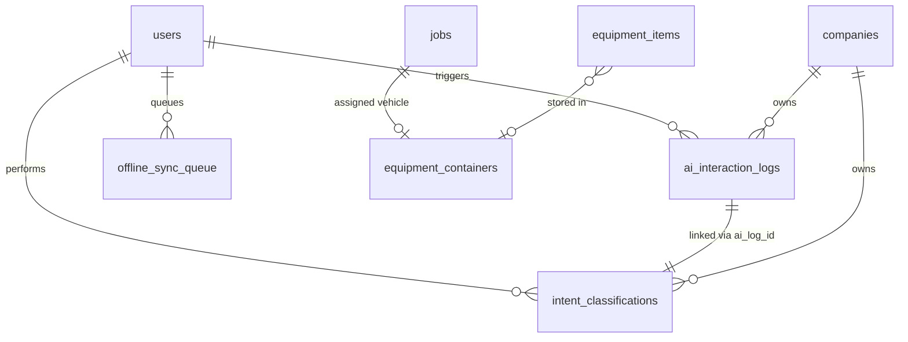

# Data Model

**Feature**: MVP Intent-Driven Mobile App  
**Date**: 2025-01-27

## Overview

This document defines the data model for the MVP intent-driven mobile app, including new entities and extensions to existing tables.

## New Entities

### AI Interaction Log

**Table**: `ai_interaction_logs`
**Purpose**: Complete audit trail of all LLM/VLM interactions for analytics and cost tracking

| Field | Type | Constraints | Description |
|-------|------|-------------|-------------|
| id | uuid | PK, DEFAULT uuid_generate_v4() | Unique identifier |
| created_at | timestamp | NOT NULL, DEFAULT NOW() | When interaction occurred |
| user_id | uuid | FK → users.id, NOT NULL | User who triggered interaction |
| company_id | uuid | FK → companies.id, NOT NULL | Company context |
| interaction_type | text | NOT NULL, CHECK (type IN ('intent', 'stt', 'tts', 'llm', 'vlm')) | Type of AI interaction |
| model_used | text | NOT NULL | Model name (e.g., 'gemini-2.0-flash', 'gpt-4-vision') |
| prompt | text | NOT NULL | Prompt sent to model |
| image_url | text | NULL | URL of image if VLM interaction |
| response | jsonb | NOT NULL | Full response from model |
| response_time_ms | integer | NOT NULL | Response time in milliseconds |
| cost_usd | decimal(10,6) | NOT NULL | Cost in USD |
| error | text | NULL | Error message if failed |
| metadata | jsonb | NULL | Additional context |

**Indexes**:
- `idx_ai_logs_user_created` ON (user_id, created_at DESC)
- `idx_ai_logs_company_type` ON (company_id, interaction_type)
- `idx_ai_logs_created` ON (created_at DESC)

**RLS Policies**:
- Users can view their own interactions
- Supervisors can view all company interactions
- Insert requires authenticated user

### Intent Classification

**Table**: `intent_classifications`  
**Purpose**: Track intent recognition results for improving accuracy

| Field | Type | Constraints | Description |
|-------|------|-------------|-------------|
| id | uuid | PK, DEFAULT uuid_generate_v4() | Unique identifier |
| created_at | timestamp | NOT NULL, DEFAULT NOW() | When classified |
| user_id | uuid | FK → users.id, NOT NULL | User who triggered |
| company_id | uuid | FK → companies.id, NOT NULL | Company context |
| image_url | text | NOT NULL | Image analyzed |
| detected_intent | text | NOT NULL, CHECK (intent IN ('inventory_add', 'job_load_verify', 'receipt_scan', 'maintenance_event', 'vehicle_add', 'unknown')) | Detected intent |
| confidence | decimal(3,2) | NOT NULL, CHECK (confidence BETWEEN 0 AND 1) | Confidence score |
| context_data | jsonb | NULL | Additional context (e.g., detected items) |
| user_action | text | NULL | What user actually did (for training) |
| ai_log_id | uuid | FK → ai_interaction_logs.id | Link to AI interaction |

**Indexes**:
- `idx_intent_user_created` ON (user_id, created_at DESC)
- `idx_intent_type_confidence` ON (detected_intent, confidence)

### Offline Sync Queue

**Table**: `offline_sync_queue`
**Purpose**: Track operations performed offline pending sync

| Field | Type | Constraints | Description |
|-------|------|-------------|-------------|
| id | uuid | PK, DEFAULT uuid_generate_v4() | Unique identifier |
| created_at | timestamp | NOT NULL, DEFAULT NOW() | When queued |
| user_id | uuid | FK → users.id, NOT NULL | User who performed action |
| operation_type | text | NOT NULL | Type of operation |
| entity_type | text | NOT NULL | Entity affected |
| entity_id | uuid | NULL | ID of entity if known |
| operation_data | jsonb | NOT NULL | Full operation details |
| sync_status | text | NOT NULL, DEFAULT 'pending', CHECK (status IN ('pending', 'syncing', 'completed', 'failed')) | Sync status |
| synced_at | timestamp | NULL | When synced |
| error | text | NULL | Error if sync failed |
| retry_count | integer | DEFAULT 0 | Number of sync attempts |

**Indexes**:
- `idx_sync_queue_status` ON (sync_status, created_at)
- `idx_sync_queue_user` ON (user_id, sync_status)

## Extended Entities

### Users (Extended)

**Modifications to existing `users` table via `app_metadata`**:

```json
{
  "role": "crew|supervisor|super_admin",
  "default_container_id": "uuid",  // User's primary work container
  "voice_enabled": true,
  "offline_enabled": true,
  "ui_preferences": {
    "theme": "light|dark",
    "button_size": "normal|large",
    "voice_feedback": true
  }
}
```

### Jobs (Extended)

**New columns for existing `jobs` table**:

| Field | Type | Constraints | Description |
|-------|------|-------------|-------------|
| assigned_vehicle_id | uuid | FK → equipment_containers.id, NULL | Primary vehicle for job |
| special_instructions_audio | text | NULL | Audio URL for instructions |
| estimated_duration_minutes | integer | NULL | Estimated job duration |
| actual_duration_minutes | integer | NULL | Actual time taken |
| completion_photo_urls | text[] | NULL | Array of completion photos |

### Equipment Items (Extended)

**Already supports** `container_id` for location tracking. No changes needed.

### New Entity Relationships



## Validation Rules

### AI Interaction Logs
- `response_time_ms` must be positive
- `cost_usd` must be >= 0
- `interaction_type` must be valid enum value
- `model_used` should match known models

### Intent Classifications  
- `confidence` must be between 0 and 1
- `detected_intent` must be valid enum value
- `image_url` must be valid URL format

### Offline Sync Queue
- `retry_count` cannot exceed 3
- `sync_status` transitions: pending → syncing → completed/failed
- Failed items older than 7 days can be purged

## State Transitions

### Offline Sync Queue States
```
pending → syncing → completed
   ↓         ↓
   ↓      failed → pending (retry)
   ↓                  ↓
   expired (after 3 retries)
```

### Job Assignment States
```
unassigned → assigned → in_progress → completed
                ↓           ↓
             cancelled   paused → in_progress
```

## Performance Considerations

1. **Indexes**: Created for common query patterns
2. **Partitioning**: Consider partitioning `ai_interaction_logs` by month after MVP
3. **Archival**: Move completed `offline_sync_queue` to archive after 30 days
4. **JSONB**: Used for flexible schema fields that may evolve

## Migration Notes

1. New tables can be created in parallel
2. Extended columns on `jobs` are nullable for backward compatibility
3. User `app_metadata` updates don't require schema changes
4. All tables must have RLS policies before production