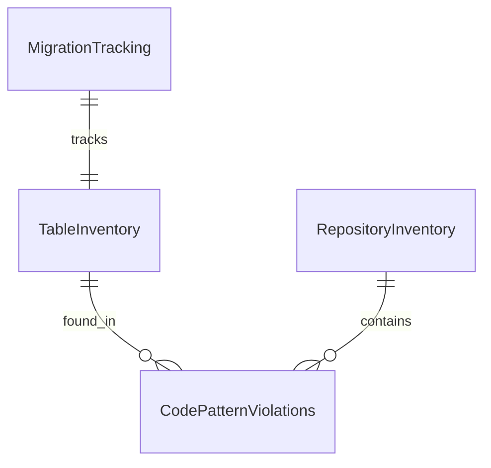

# Data Model: Codebase Cleanup and Refactoring

**Feature**: 009-codebase-cleanup-and | **Date**: 2025-10-03

## Overview
This document defines the data structures needed to track and manage the codebase cleanup process.

## Entities

### 1. Migration Tracking

**Purpose**: Track progress of tenant_id migrations across tables

**Fields**:
| Field | Type | Description | Constraints |
|-------|------|-------------|-------------|
| id | UUID | Unique identifier | Primary key |
| table_name | string | Name of table being migrated | Required, unique |
| has_company_id | boolean | Whether table originally had company_id | Required |
| has_tenant_id | boolean | Whether table now has tenant_id | Required |
| row_count | integer | Number of rows in table | Required, >= 0 |
| migration_status | enum | Current status of migration | Required |
| migrated_at | timestamp | When migration completed | Nullable |
| error_message | string | Any error during migration | Nullable |
| created_at | timestamp | When record created | Required |
| updated_at | timestamp | When record last updated | Required |

**Migration Status Enum**:
- `pending` - Not yet started
- `in_progress` - Migration running
- `completed` - Successfully migrated
- `failed` - Migration failed
- `skipped` - Table skipped (no company_id)

**State Transitions**:
```
pending → in_progress → completed
                    ↘ → failed
pending → skipped
```

### 2. Table Inventory

**Purpose**: Categorize all tables for cleanup decisions

**Fields**:
| Field | Type | Description | Constraints |
|-------|------|-------------|-------------|
| id | UUID | Unique identifier | Primary key |
| schema_name | string | Database schema | Required |
| table_name | string | Table name | Required |
| category | enum | Classification of table | Required |
| row_count | integer | Current row count | Required, >= 0 |
| has_code_references | boolean | Found in codebase | Required |
| has_relationships | boolean | Has foreign keys | Required |
| last_modified | timestamp | Last data modification | Nullable |
| decision | enum | What to do with table | Required |
| decision_reason | string | Why this decision | Nullable |
| created_at | timestamp | When analyzed | Required |

**Category Enum**:
- `active` - Has data and code references
- `empty_with_code` - No data but has code
- `orphaned` - No data, no code references
- `staging` - Empty but part of planned feature

**Decision Enum**:
- `keep` - Maintain table
- `seed` - Add test data
- `remove` - Drop table
- `document` - Keep with documentation

### 3. Code Pattern Violations

**Purpose**: Track deprecated patterns found in code

**Fields**:
| Field | Type | Description | Constraints |
|-------|------|-------------|-------------|
| id | UUID | Unique identifier | Primary key |
| file_path | string | Path to file | Required |
| line_number | integer | Line in file | Required, > 0 |
| column_number | integer | Column in line | Required, > 0 |
| pattern_type | enum | Type of violation | Required |
| violation_text | string | Actual code text | Required |
| suggested_fix | string | Recommended replacement | Required |
| is_fixed | boolean | Whether fixed | Required, default false |
| fixed_at | timestamp | When fixed | Nullable |
| created_at | timestamp | When detected | Required |

**Pattern Type Enum**:
- `company_id_usage` - Uses company_id instead of tenant_id
- `functional_repository` - Repository as function not class
- `missing_rls` - Table operation without RLS
- `direct_db_access` - Bypasses repository pattern
- `wrong_rls_path` - Uses incorrect JWT path

### 4. Repository Inventory

**Purpose**: Track repository pattern migration

**Fields**:
| Field | Type | Description | Constraints |
|-------|------|-------------|-------------|
| id | UUID | Unique identifier | Primary key |
| domain | string | Domain name | Required |
| repository_name | string | Repository name | Required |
| file_path | string | Path to file | Required |
| pattern_type | enum | Current pattern | Required |
| target_pattern | enum | Desired pattern | Required |
| migration_status | enum | Migration progress | Required |
| dependencies_count | integer | Number of consumers | Required, >= 0 |
| created_at | timestamp | When analyzed | Required |
| migrated_at | timestamp | When migrated | Nullable |

**Pattern Type Enum**:
- `class_based` - Extends BaseRepository
- `functional` - Exported functions
- `singleton` - Single instance
- `mixed` - Multiple patterns

## Relationships



## Validation Rules

### Migration Tracking
- `table_name` must exist in database
- `migration_status` transitions must follow state machine
- `migrated_at` required when status is `completed`
- `error_message` required when status is `failed`

### Table Inventory
- `schema_name` + `table_name` must be unique
- `decision_reason` required when decision is `remove`
- `category` must align with `has_code_references` and `row_count`

### Code Pattern Violations
- `file_path` must exist in repository
- `line_number` must be valid for file
- `suggested_fix` must differ from `violation_text`
- `fixed_at` only set when `is_fixed` is true

### Repository Inventory
- `file_path` must exist and be TypeScript file
- `target_pattern` must be `class_based` for cleanup
- `dependencies_count` must be accurate for safe migration

## Indexes

```sql
-- Migration Tracking
CREATE INDEX idx_migration_status ON migration_tracking(migration_status);
CREATE INDEX idx_migration_table ON migration_tracking(table_name);

-- Table Inventory
CREATE INDEX idx_table_category ON table_inventory(category);
CREATE INDEX idx_table_decision ON table_inventory(decision);
CREATE UNIQUE INDEX idx_table_unique ON table_inventory(schema_name, table_name);

-- Code Pattern Violations
CREATE INDEX idx_violation_type ON code_pattern_violations(pattern_type);
CREATE INDEX idx_violation_fixed ON code_pattern_violations(is_fixed);
CREATE INDEX idx_violation_file ON code_pattern_violations(file_path);

-- Repository Inventory
CREATE INDEX idx_repo_status ON repository_inventory(migration_status);
CREATE INDEX idx_repo_pattern ON repository_inventory(pattern_type);
```

## Usage Examples

### Track Migration Progress
```typescript
const migration = await migrationRepo.create({
  table_name: 'day_plans',
  has_company_id: true,
  has_tenant_id: false,
  row_count: 2,
  migration_status: 'pending'
});

// During migration
await migrationRepo.update(migration.id, {
  migration_status: 'in_progress'
});

// After success
await migrationRepo.update(migration.id, {
  migration_status: 'completed',
  has_tenant_id: true,
  migrated_at: new Date()
});
```

### Categorize Tables
```typescript
const orphanedTables = await tableInventoryRepo.findAll({
  category: 'orphaned',
  decision: 'pending'
});

for (const table of orphanedTables) {
  const hasReferences = await checkCodeReferences(table.table_name);
  await tableInventoryRepo.update(table.id, {
    has_code_references: hasReferences,
    decision: hasReferences ? 'keep' : 'remove',
    decision_reason: hasReferences 
      ? 'Found code references' 
      : 'No code dependencies'
  });
}
```

### Track Violations
```typescript
const violations = await codePatternRepo.findAll({
  pattern_type: 'company_id_usage',
  is_fixed: false
});

console.log(`Found ${violations.length} company_id violations to fix`);
```

## Notes

- These entities are for tracking cleanup progress only
- They can be removed after cleanup is complete
- Consider keeping violation tracking for ongoing monitoring
- Migration tracking provides audit trail for changes