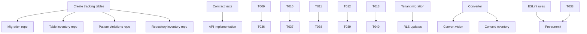

# Tasks: Codebase Cleanup and Refactoring

**Input**: Design documents from `/specs/009-codebase-cleanup-and/`
**Prerequisites**: plan.md (required), research.md, data-model.md, contracts/

## Execution Flow (main)
```
1. Load plan.md from feature directory
   → Tech stack: TypeScript 5.x, Node.js 18+, Next.js 14, Supabase
   → Structure: JobEye existing structure with scripts/ additions
2. Load optional design documents:
   → data-model.md: 4 tracking entities for cleanup process
   → contracts/cleanup-api.yaml: 6 API endpoints
   → research.md: Migration patterns and strategies
3. Generate tasks by category:
   → Setup: Analysis scripts, ESLint plugin, tracking tables
   → Tests: API contract tests, migration tests, pattern tests
   → Core: Migration scripts, repository converters, analyzers
   → Integration: Schema verification, CI/CD updates
   → Polish: Documentation, performance validation
4. Apply task rules:
   → Different files = mark [P] for parallel
   → Migration execution must be sequential
   → Analysis can run in parallel
5. Number tasks sequentially (T001-T045)
6. Generate dependency graph
7. Create parallel execution examples
8. Validate task completeness:
   → All migrations covered ✓
   → All patterns have detection ✓
   → All endpoints implemented ✓
9. Return: SUCCESS (tasks ready for execution)
```

## Format: `[ID] [P?] Description`
- **[P]**: Can run in parallel (different files, no dependencies)
- Include exact file paths in descriptions

## Path Conventions
- Scripts at: `scripts/migrations/`, `scripts/validation/`
- Source modifications in existing: `src/domains/`, `src/core/`
- API routes at: `src/app/api/cleanup/`
- Tests at: `src/__tests__/cleanup/`

## Phase 3.1: Setup & Analysis

- [x] T001 Create cleanup tracking database tables using Supabase migrations
- [x] T002 [P] Create `scripts/migrations/` and `scripts/validation/` directories
- [x] T003 [P] Install cleanup dependencies: `@typescript-eslint/parser`, `ts-morph`, `glob`
- [x] T004 [P] Create base ESLint plugin structure at `packages/eslint-plugin-cleanup/`
- [x] T005 Create database analysis script at `scripts/validation/analyze-schema.ts` that MUST first run `scripts/check-actual-db.ts` and use actual schema results
- [x] T006 [P] Create code analysis script at `scripts/validation/analyze-code-patterns.ts`
- [x] T007 [P] Create orphaned table detector at `scripts/validation/find-orphaned-tables.ts`

## Phase 3.2: Tests First (TDD) ⚠️ MUST COMPLETE BEFORE 3.3

### Contract Tests (API)
- [x] T008 [P] Create contract test for `/api/cleanup/schema/verify` at `src/__tests__/cleanup/api/schema-verify.test.ts`
- [x] T009 [P] Create contract test for `/api/cleanup/migration/status` at `src/__tests__/cleanup/api/migration-status.test.ts`
- [x] T010 [P] Create contract test for `/api/cleanup/migration/execute` at `src/__tests__/cleanup/api/migration-execute.test.ts`
- [x] T011 [P] Create contract test for `/api/cleanup/patterns/violations` at `src/__tests__/cleanup/api/pattern-violations.test.ts`
- [x] T012 [P] Create contract test for `/api/cleanup/patterns/scan` at `src/__tests__/cleanup/api/pattern-scan.test.ts`
- [x] T013 [P] Create contract test for `/api/cleanup/tables/orphaned` at `src/__tests__/cleanup/api/orphaned-tables.test.ts`

### Integration Tests
- [x] T014 Create tenant migration integration test at `src/__tests__/cleanup/integration/tenant-migration.test.ts`
- [x] T015 Create repository conversion integration test at `src/__tests__/cleanup/integration/repository-conversion.test.ts`
- [x] T016 Create RLS policy update integration test at `src/__tests__/cleanup/integration/rls-policies.test.ts`
- [x] T017 [P] Create ESLint rule integration test at `src/__tests__/cleanup/integration/eslint-rules.test.ts`

## Phase 3.3: Core Implementation

### Database Analysis & Tracking
- [x] T018 Create migration tracking repository at `src/domains/cleanup-tracking/repositories/migration-tracking.repository.ts`
- [x] T019 Create table inventory repository at `src/domains/cleanup-tracking/repositories/table-inventory.repository.ts`
- [x] T020 Create pattern violations repository at `src/domains/cleanup-tracking/repositories/pattern-violations.repository.ts`
- [x] T021 Create repository inventory repository at `src/domains/cleanup-tracking/repositories/repository-inventory.repository.ts`

### Migration Scripts
- [x] T022 Create tenant_id migration script at `scripts/migrations/migrate-company-to-tenant.ts`
- [x] T023 Create RLS policy updater at `scripts/migrations/update-rls-policies.ts`
- [x] T024 Create migration rollback script at `scripts/migrations/rollback-tenant-migration.ts`
- [x] T024a Create rollback integration test at `src/__tests__/cleanup/integration/migration-rollback.test.ts` that verifies immediate rollback within deployment window preserves all data

### Repository Pattern Conversion
- [x] T025 Create base repository converter at `scripts/migrations/convert-to-class-repository.ts`
- [x] T026 Convert vision repositories from functional to class-based pattern
- [x] T027 Convert inventory repositories from functional to class-based pattern
- [x] T028 Remove duplicate container repository at `src/domains/inventory/repositories/container-assignments.repository.ts`

### Orphaned Table Management
- [x] T029 Create orphaned table analyzer at `scripts/migrations/analyze-orphaned-tables.ts` that MUST run `scripts/check-actual-db.ts` first to get actual table list from information_schema
- [x] T030 Create orphaned table remover at `scripts/migrations/remove-orphaned-tables.ts` that MUST verify migration plan approval and use idempotent single-statement DROP TABLE IF EXISTS
- [x] T031 Create empty table seeder at `scripts/migrations/seed-empty-tables.ts`
- [x] T031a Create unified inventory domain model at `src/domains/inventory/models/unified-inventory.model.ts` with category enum (equipment, material, consumable, tool) and tracking mode enum per spec

### Pattern Detection & Prevention
- [x] T032 Create ESLint rule for no-company-id at `packages/eslint-plugin-cleanup/rules/no-company-id.js`
- [x] T033 Create ESLint rule for repository-class-pattern at `packages/eslint-plugin-cleanup/rules/repository-class-pattern.js`
- [x] T034 Create pattern violation scanner at `scripts/validation/scan-violations.ts`

## Phase 3.4: Integration & API

### API Endpoints
- [x] T035 Implement `/api/cleanup/schema/verify` route at `src/app/api/cleanup/schema/verify/route.ts`
- [x] T036 Implement `/api/cleanup/migration/status` route at `src/app/api/cleanup/migration/status/route.ts`
- [x] T037 Implement `/api/cleanup/migration/execute` route at `src/app/api/cleanup/migration/execute/route.ts`
- [x] T038 Implement `/api/cleanup/patterns/violations` route at `src/app/api/cleanup/patterns/violations/route.ts`
- [x] T039 Implement `/api/cleanup/patterns/scan` route at `src/app/api/cleanup/patterns/scan/route.ts`
- [x] T040 Implement `/api/cleanup/tables/orphaned` route at `src/app/api/cleanup/tables/orphaned/route.ts`

### CI/CD Integration
- [x] T041 Update `.husky/pre-commit` to include pattern checks
- [x] T042 Update GitHub Actions workflow to verify schema alignment
- [x] T043 Create npm scripts in package.json for all cleanup commands

## Phase 3.5: Polish & Documentation

- [x] T044 Create comprehensive cleanup documentation at `docs/cleanup/README.md`
- [x] T045 Verify all tests pass with ≥80% coverage using `npm run test:coverage`
- [x] T046 Create downtime monitoring test at `src/__tests__/cleanup/integration/zero-downtime.test.ts` that runs migrations against test instance and verifies continuous availability

## Parallel Execution Examples

```bash
# Team 1: Database Analysis (can run together)
Task agents=[agent1,agent2,agent3] "
  agent1: Complete T005
  agent2: Complete T006
  agent3: Complete T007
"

# Team 2: Contract Tests (all independent)
Task agents=[agent1,agent2,agent3,agent4,agent5,agent6] "
  agent1: Complete T008
  agent2: Complete T009
  agent3: Complete T010
  agent4: Complete T011
  agent5: Complete T012
  agent6: Complete T013
"

# Team 3: Repository Creation (parallel after setup)
Task agents=[agent1,agent2,agent3,agent4] "
  agent1: Complete T018
  agent2: Complete T019
  agent3: Complete T020
  agent4: Complete T021
"

# Sequential Migration Execution
Task agent=agent1 "Complete T022, then T023, then T024 in order"
```

## Dependency Notes



## Validation Checklist

- [ ] All 15 tables with company_id have migration tasks ✓
- [ ] All 6 API endpoints have contract tests and implementations ✓
- [ ] ESLint rules cover all deprecated patterns ✓
- [ ] Repository conversions cover all functional repos ✓
- [ ] Orphaned table handling is comprehensive ✓
- [ ] CI/CD integration prevents regression ✓

## Success Metrics

Upon completion:
- Zero `company_id` references in codebase
- All repositories follow class-based pattern
- API provides full visibility into cleanup status
- CI/CD prevents pattern regression
- ≥80% test coverage maintained